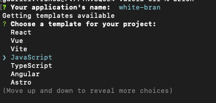
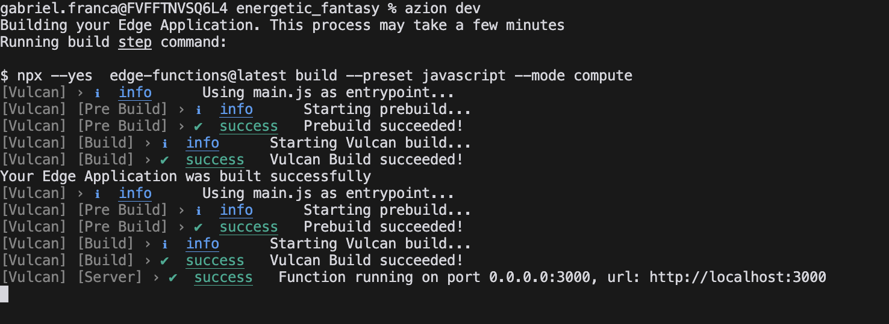

# Better Deploying Experience for Web Frameworks at the Edge

As developers, we are all familiar with the accelerated, ever-changing world of web frameworks. Sometimes, it can be confusing as excelling at using a specific framework requires a deeper understanding that goes beyond just knowing the programming language. One of the significant obstacles faced is configuring the project to run smoothly on different environments.

Questions such as "Will it run on the cloud?" and "Which platform should it run on?" often arise. But what if you could deploy your project on the edge of the network, leveraging low latency, security, and availability without worrying about the specific environment? This blog post explores the concept of adapting projects to run at the edge and introduces a solution that simplifies the process.

## Adapting Projects to Run at the Edge

To ensure a seamless deployment, a project must be structured in a way that avoids friction with the host platform. It is not uncommon to encounter situations where the settings required to run an application on one platform bear little resemblance to those needed for a different platform. This can lead to vendor lock-in, where switching hosts becomes costly in terms of time and money, forcing customers to stick with the current service provider.

At Azion, we value the power of open-source software and aim to empower modern web development. Our platform enables the initialization and deployment of projects in various web frameworks, including:

- Next.js
- React
- Vue
- Astro
- Angular
- Hexo
- Vite
- JavaScript itself

Azion provides its own [Edge Runtime]() designed to deliver an optimal experience for running applications at the edge. This runtime powers [Azion Edge Functions]() and opens up a world of possibilities for both developers and companies. Additionally, we have developed [Vulcan]() to bridge the gaps and enable web frameworks to run natively at the edge. Vulcan simplifies the integration of *polyfills* for Edge Computing, revolutionizing the process of creating Workers, especially for the Azion platform.

> If you're curious about what *polyfills* are, they are code snippets used in JavaScript to provide modern functionality to environments that do not natively support it. Polyfills fill in the gaps, ensuring consistent behavior across different browsers. For example, let's consider a runtime that lacks support for a specific Node.js API, which a project depends on. During the build process, Vulcan recognizes the signature of this API and replaces it with a relative API, eliminating the need for manual project adaptation.

Vulcan excels in setting up an intuitive and streamlined protocol for the creation of *presets*. This feature enhances customization and allows developers to adapt their applications to unique project requirements, providing the flexibility needed to optimize them effectively.

## Configuring a Project

The [Azion CLI]() is an outstanding tool that greatly enhances the developer experience. With the CLI installed in your environment, initializing a project is as simple as running the following command:

```bash
azion
```
This command initiates an interactive journey where you can choose the desired template.



Once you've selected the template, each framework will present a specific set of steps. Choose to run the project locally and install the required dependencies.

### Leveraging Polyfills

Vulcan makes it possible to leverage *polyfills*. Let's take a closer look at how to configure a project to utilize this feature.

**Example**: Suppose you want to initialize a JavaScript project that utilizes the Node.js Buffer API. To achieve this, you need to inform Vulcan that the project implements polyfills.

Vulcan reads a configuration file called `vulcan.config.js`. Create this file and include the following properties:

```js
module.exports = {
  entry: 'main.js',
  builder: 'webpack',
  useNodePolyfills: true,
};
```

- **entry**: Represents the primary entry point for your application where the build process begins. Not applicable for Jamstack solutions.
- **builder**: Defines the build tool to use, either `esbuild` or `webpack`.
- **useNodePolyfills**: Specifies whether Node.js polyfills should be applied.

After applying these settings, you can import the necessary APIs into your project. For example, let's consider importing the Node.js Buffer:

**Inside main.js**:

```js
// Import the Buffer class from the 'buffer' module in Node.js
import { Buffer } from 'node:buffer';

// Define a function named 'myWorker' that takes an event as an argument
export default function myWorker(event) {
  // Create a new Buffer instance 'buf1' from the string "x"
  var buf1 = Buffer.from("x");
  // Create a new Buffer instance 'buf2' from the string "x"
  var buf2 = Buffer.from("x");
  // Compare 'buf1' and 'buf2' using the Buffer.compare method,
  // which returns a number indicating the equality of the buffers
  var a = Buffer.compare(buf1, buf2);

  // The result will be 0 since both buffers are equal
  console.log(a);

  // Now, let's swap the values of 'buf1' and 'buf2'
  buf1 = Buffer.from("y");
  buf2 = Buffer.from("x");
  // Compare 'buf1' and 'buf2' again
  a = Buffer.compare(buf1, buf2);

  // Here, the result will be 1
  console.log(a);

  // The function returns a new Response object with the string "Testing buffer polyfills"
  return new Response("Testing polyfills");
}
```

To run the project locally, use the following command:

```bash 
azion dev
```

**Output**:



Now, you can access the project locally.

> Note: Make sure you are in the root directory of your project for the commands to execute correctly.

The `azion dev` command initiates the **build process**, which is seamlessly handled by Vulcan.

The sample project used in this example can be found in the [Azion Samples](https://github.com/aziontech/azion-samples/tree/dev/samples/polyfills/buffer) repository on GitHub.

---

## Edge Runtime, Vulcan and Azion CLI


### Process explained 

1. The user initiates the process by running `azion` or `azion init` via Azion CLI, and selects the desired template.
2. Azion CLI then invokes Vulcan, which takes charge of initializing the project.
3. Once initialized, Vulcan hands the project back to the user, who then decides whether to deploy the project or run it locally.
4. If the user opts to run the project locally, Vulcan triggers the build process and generates the worker.
5. If the user decides to deploy the project, they run the `azion deploy` command. This initiates the build process again, after which Azion CLI creates an edge application and deploys it onto Azion's distributed edge network.
6. Upon successful deployment, Azion CLI provides the domain of the application. After a brief waiting period, the application becomes accessible.

### Responsibilities 

**Azion CLI**: the command-line interface that serves as the primary point of interaction between the user and the system. It manages the entire application deployment process, ensuring a smooth and efficient workflow.

**Vulcan**: the engine that drives project initialization, building, and adaptation. It intelligently tailors the project based on the selected template, ensuring that the application is optimally configured for its intended use.

**Azion Edge Runtime**: the runtime environment that hosts the application and manages its execution. The application is distributed through Azion's global network of Edge Nodes, ensuring that it is always close to its delivery point, thereby maximizing speed and efficiency.

---

By utilizing Azion's platform, developers can now enjoy a better deploying experience for web frameworks at the edge. Adapt your projects to run seamlessly while focusing on the core functionality rather than worrying about the specific environment. With Azion's Edge Runtime and Vulcan tool, developers gain the power to optimize their applications effectively, leveraging low latency, security, and availability at the edge of the network.